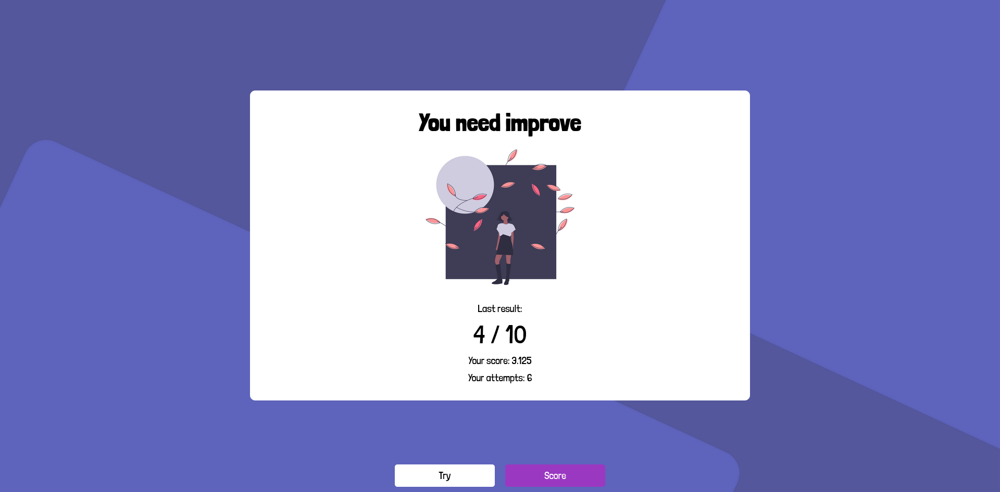
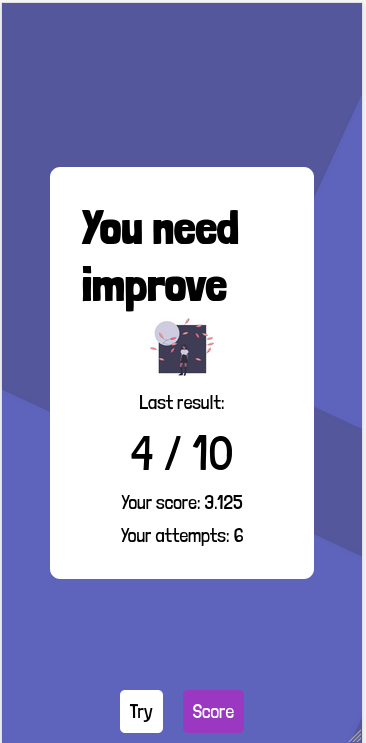

# :bowtie: A [DevChallenge.io](https://devchallenges.io) challenge

Today, we are going doing a challenge of DevChallenges.io. It´s on front-end section.

It´s a simple game where you must to know the countries capitals

I´ve made the website responsive (although there are still some things to do)

# :running: Run project in localhost

1. First clone this repo:

```
git clone
```

2. Install Node:
   [Nodejs](https://nodejs.org/en/)

3. Run project:
   - If you don´t have Angular CLI installed:
   ```
   npx -p @angular/cli@10 ng serve --port <port you prefer>
   ```
   - If you have Angular CLI installed:
   ```
   ng serve --port <port you prefer>
   ```
   - If you wanna to see the website in your tablet or phone add --host in the previous step

# :eyes: Visit de Demo web

Go to [demo web](https://valen-developer.github.io/Country-Game-DevChallenges.io/quiz)

# :camera: Screenshots

   

